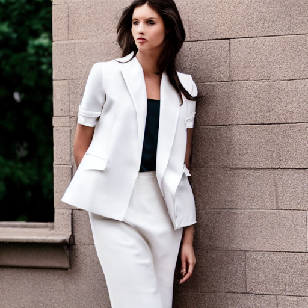
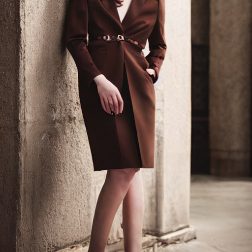
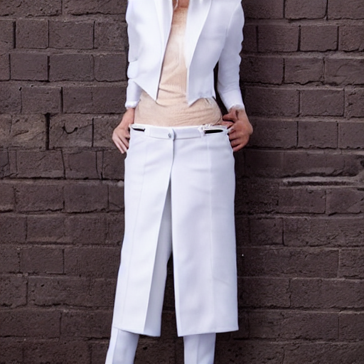
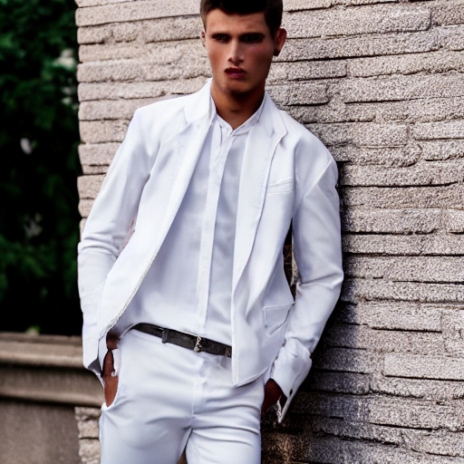
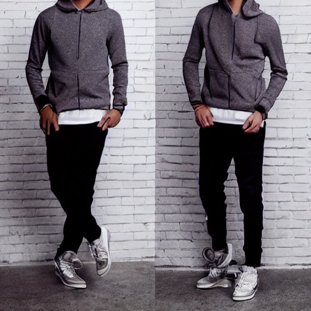
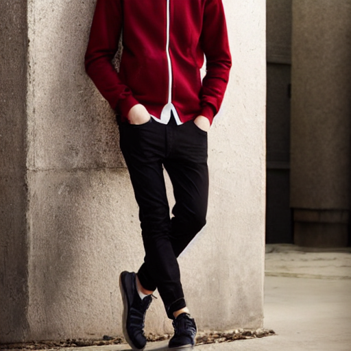
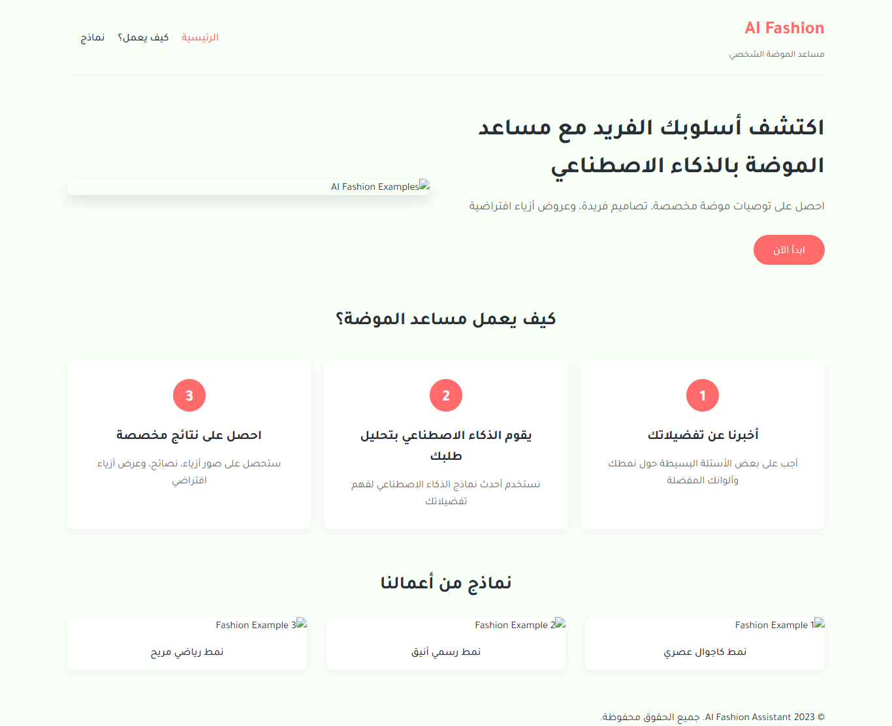
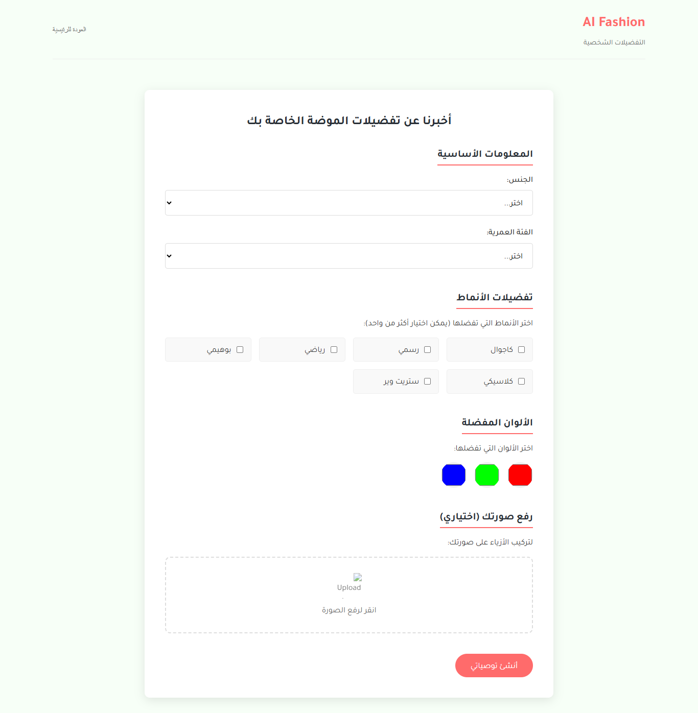

# 🎨 AI Fashion Assistant

<div align="center">


**A full-stack AI-powered fashion assistant that generates personalized outfit recommendations, AI-generated images, and promotional videos.**

[English](#-overview)

</div>

---


## 🌐 Overview

AI Fashion Assistant is a full-stack web application powered by generative AI models:

- 👗 **Personalized fashion advice** based on gender, age group, preferred styles and colors
- 🖼️ **AI-generated outfit images** using Stable Diffusion v1.5
- 🎬 **Auto-generated promo video** with transition effects between images
- 💬 **Smart fashion tips** powered by DeepSeek via OpenRouter API

---

## 🏗️ Project Structure

```
AI-Fashion-Assistant/
├── main.py                  # Flask backend — API routes & model logic
├── requirements.txt         # Python dependencies
├── .env.example             # Environment variables template
├── run.ipynb                # Jupyter notebook for Colab / experimentation
├── static/
│   ├── script.js            # Frontend JavaScript (API calls, UI logic)
│   └── styles.css           # Styling (RTL Arabic support)
├── templates/
│   ├── index.html           # Main UI (Arabic RTL)
│   ├── upload-icon.svg      # UI asset
│   └── download.jpeg        # Hero image
├── uploads/                 # User uploaded files (git-ignored)
└── generated_media/         # AI-generated images & videos (git-ignored)
```

---

## ⚙️ Tech Stack

| Component | Technology |
|-----------|-----------|
| Backend | Flask + Flask-CORS |
| Image Generation | Stable Diffusion v1.5 (via Diffusers) |
| Video Generation | Frame blending + zoom effects (PIL + NumPy) |
| LLM (Fashion Advice) | DeepSeek via OpenRouter API |
| Frontend | Vanilla JS + CSS (RTL/Arabic) |
| GPU Support | PyTorch (CUDA / CPU fallback) |
| Tunneling | ngrok (for Colab / cloud environments) |

---

## 🚀 Getting Started

### 1. Clone the Repository

```bash
git clone https://github.com/zienabmakhloof-ai/AI-Fashion-Assistant-.git
cd AI-Fashion-Assistant-
```

### 2. Create a Virtual Environment

```bash
python -m venv venv
source venv/bin/activate        # Linux / macOS
# venv\Scripts\activate         # Windows
```

### 3. Install Dependencies

```bash
pip install -r requirements.txt
```

```

### 4. Configure Environment Variables

```bash
cp .env.example .env
```

Then open `.env` and fill in your API keys:

```env
HF_TOKEN=your_huggingface_token
OPENROUTER_API_KEY=your_openrouter_key
NGROK_TOKEN=your_ngrok_token        # Only needed for Colab / cloud
```

### 5. Run the App

```bash
python main.py
```

Open your browser at: **http://localhost:5000**

---

## ☁️ Running on Google Colab

Open `run.ipynb` in Google Colab for a ready-to-run notebook with GPU acceleration.  
Set your secrets in Colab's **Secrets** panel (🔑 icon) instead of a `.env` file:

| Secret Name | Value |
|-------------|-------|
| `HF_TOKEN` | Your HuggingFace token |
| `OPENROUTER_API_KEY` | Your OpenRouter API key |
| `NGROK_TOKEN` | Your ngrok auth token |

---

---

## ✨ Generated Results

### 🖼️ AI-Generated Outfit Images 

<div align="center">

| 👩 Female | 👩 Female | 👩 Female |
|:---:|:---:|:---:|
|  |  |  |

| 👨 Male | 👨 Male | 👨 Male |
|:---:|:---:|:---:|
|  |  |  |

</div>

---

### 🎬 Demo Video 

<div align="center">


https://github.com/user-attachments/assets/7731b747-7640-4d85-9489-0bfc905a1682


https://github.com/user-attachments/assets/45e639bc-0aad-4926-bbbb-ef8fdb449ab9


> *The app automatically generates a promotional video combining all outfit images with smooth transition effects.*
</div>

---

### 🖥️ App Interface 

<div align="center">

|  |  |

</div>

-----

## 🔑 API Keys — Where to Get Them

| Key | Link |
|-----|------|
| `HF_TOKEN` | [huggingface.co/settings/tokens](https://huggingface.co/settings/tokens) |
| `OPENROUTER_API_KEY` | [openrouter.ai/keys](https://openrouter.ai/keys) |
| `NGROK_TOKEN` | [dashboard.ngrok.com](https://dashboard.ngrok.com/get-started/your-authtoken) |

---

## 📡 API Reference

### `POST /api/generate`

Generate fashion recommendations, images, and video.

**Request Body:**
```json
{
  "preferences": {
    "gender": "female",
    "ageGroup": "18-25",
    "styles": ["casual", "modern"],
    "colors": ["blue", "white"]
  }
}
```

**Response:**
```json
{
  "success": true,
  "advice": "نصائح الموضة المخصصة...",
  "outfits": [
    "/generated_media/fashion_1234_0.png",
    "/generated_media/fashion_1234_1.png",
    "/generated_media/fashion_1234_2.png"
  ],
  "video": "/generated_media/fashion_ad_1234.mp4"
}
```

---

## 🧠 Models Used

| Model | Purpose | Source |
|-------|---------|--------|
| `runwayml/stable-diffusion-v1-5` | Image generation | HuggingFace |
| `cerspense/zeroscope_v2_576w` | Video generation (optional) | HuggingFace |
| `deepseek/deepseek-chat-v3-0324:free` | Fashion advice (LLM) | OpenRouter |

---

## ⚠️ Important Notes

- **GPU recommended:** Image generation on CPU is very slow (several minutes per image). A GPU (NVIDIA with CUDA) will reduce this to seconds.
- **First run:** Models will be downloaded automatically (~4-8 GB). This takes time once, then they are cached.
- **Generated files:** Images and videos are saved to `generated_media/`.

---


<div align="center">
Made with ❤️ using Flask, PyTorch, and Diffusers
</div>
